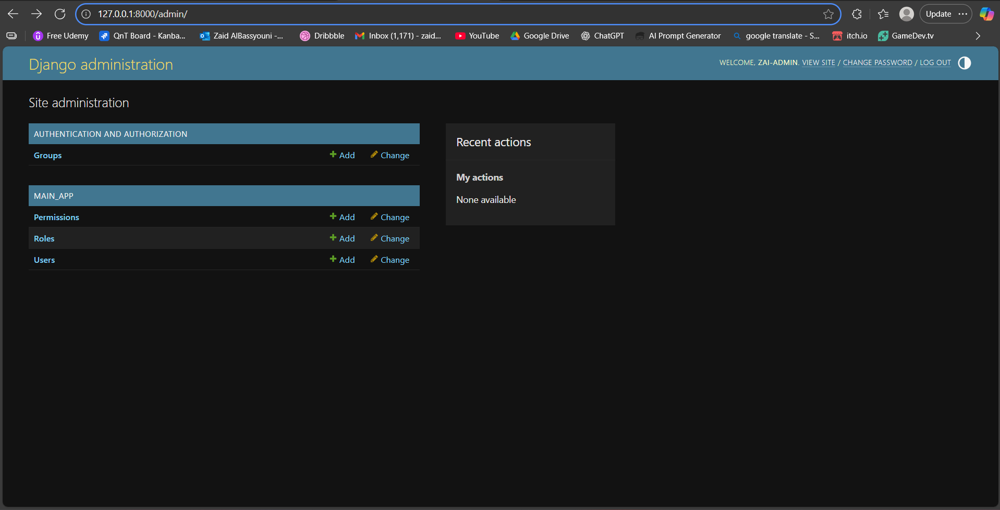
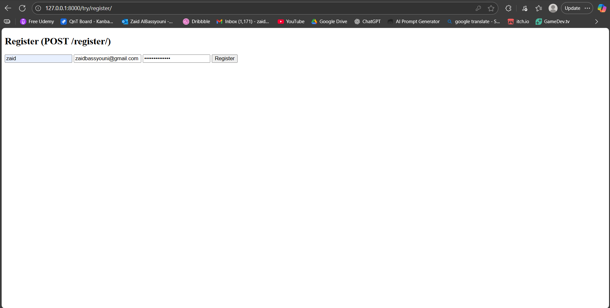
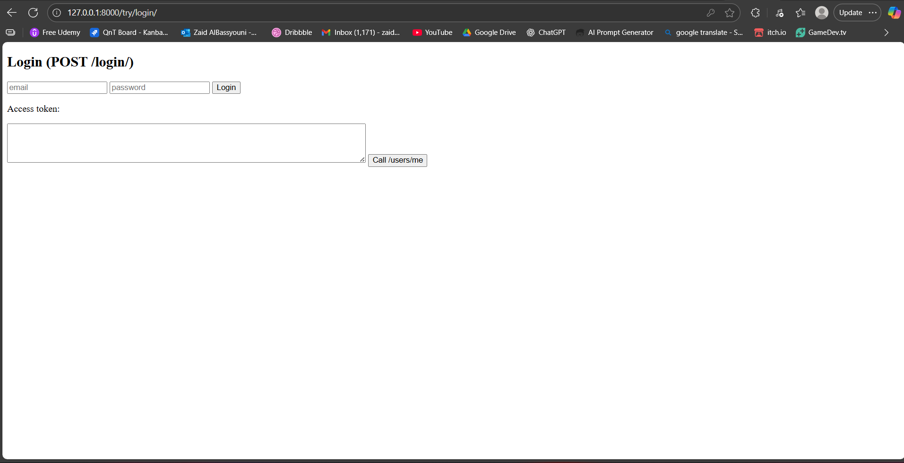
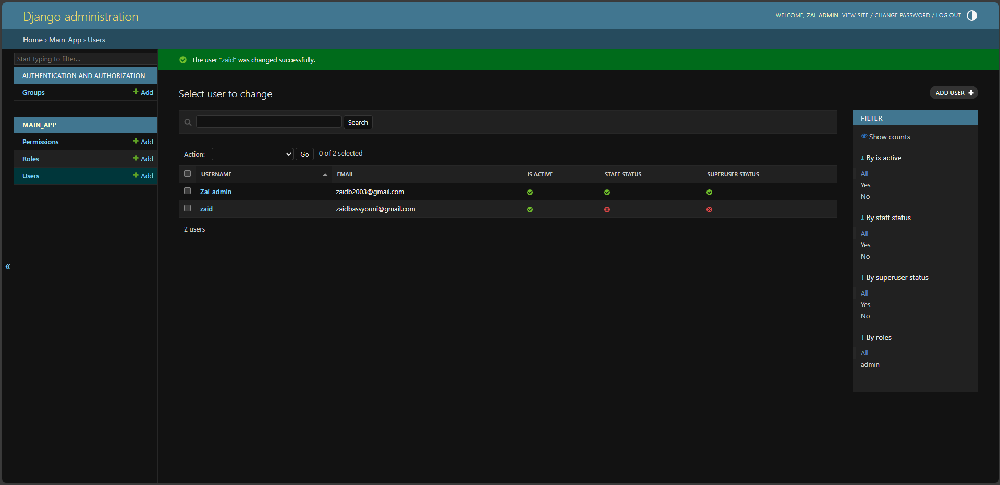

# Fintesa Technical Test Project — User Authentication & Authorization System (Django + DRF)

Documentation for the **User Authentication and Authorization System** built with **Python**, **Django**, and **Django REST Framework**, using **JWT-based authentication**.

**Repository:** [https://github.com/Zaid-Bassyouni/Zaid-Technical-Test-Project-Fintesa.git](https://github.com/Zaid-Bassyouni/Zaid-Technical-Test-Project-Fintesa.git)

---

## Table of Contents

1. Project Overview  
2. Tech Stack  
3. Project Structure  
4. Prerequisites  
5. Installation & Setup  
6. Database Schema / Models  
7. Running the Application  
8. API Endpoints  
9. Example Responses  
10. Authentication & Authorization  
11. Protected Routes & Permissions  
12. Testing  
13. Migrations & Seeding  
14. Troubleshooting  
15. Example cURL Commands  
16. Screenshots  

---

## 1. Project Overview

This project implements a secure **User Authentication and Authorization System** using Django and Django REST Framework (DRF) with JWT authentication.  
It includes user registration, login, JWT-based token management, and role-based access control (admin/user).  
The system also provides simple HTML pages for testing registration and login.

---

## 2. Tech Stack

| Component      | Version / Tool                      |
| -------------- | ----------------------------------- |
| Language       | Python 3.11+                        |
| Framework      | Django 5.2.7                        |
| API Framework  | Django REST Framework 3.16.1        |
| Authentication | djangorestframework-simplejwt 5.5.1 |
| Database       | PostgreSQL                          |
| ORM            | Django ORM                          |

**Dependencies:**
```bash
asgiref==3.10.0
Django==5.2.7
djangorestframework==3.16.1
djangorestframework-simplejwt==5.5.1
psycopg2-binary==2.9.11
PyJWT==2.10.1
sqlparse==0.5.3
tzdata==2025.2
```
---


## 3. Project Structure
```bash
 Zaid-Technical-Test-Project-Fintesa/
 ├── fintesa_auth_project/
 ├── main_app/
 │   ├── models.py
 │   ├── serializers.py
 │   ├── views.py
 │   ├── urls.py
 │   ├── apps.py
 │   ├── admin.py
 │   └── tests.py
 ├── templates/
 │   ├── homepage.html
 │   ├── register_form.html
 │   └── login_form.html
 ├── screens/test-screens/
 │    ├── ...
 │    ├── (It contains screenshots to demonstrate the project proficiency)
 │    └── ...
 │
 ├── manage.py
 ├── requirements.txt
 └── README.md
```

---

## 4. Prerequisites

- Python 3.11 or later  
- PostgreSQL  
- pip and virtualenv installed

---

## 5. Installation & Setup

```bash
# Clone the repository
git clone https://github.com/Zaid-Bassyouni/Zaid-Technical-Test-Project-Fintesa.git
cd Zaid-Technical-Test-Project-Fintesa

# Create and activate a virtual environment
python -m venv venv
venv\Scripts\activate      # On Windows
source venv/bin/activate   # On Mac/Linux

# Install dependencies
pip install -r requirements.txt

# Run migrations
python manage.py migrate

# Create superuser (for Django Admin)
python manage.py createsuperuser

# Run the development server
python manage.py runserver
```
Access the app at http://127.0.0.1:8000/

---


## 6. Database Schema / Models
```bash
## User
• id 
• username (unique) 
• email (unique) 
• password (hashed) 
• roles (ManyToMany -> Role)
• user_permissions (ManyToMany -> Permission) 
• is_active, is_staff, is_superuser

 Role
• id
• name (unique, “admin”, “user”)
• permissions (ManyToMany → Permission)
 
 Permission
• id
• name (unique) 

```
---
## 7. Running the Application
```bash
python manage.py runserver
```
Access URLs:
```
• Homepage → http://127.0.0.1:8000/
• Register Test Page → http://127.0.0.1:8000/try/register/
• Login Test Page → http://127.0.0.1:8000/try/login/
• Django Admin Panel → http://127.0.0.1:8000/admin/
```
---

##  8. API Endpoints

| Method   |    Endpoint    |       Description       |   Auth    |
| -------- | ---------------|-------------------------|---------- |
| GET      |     /          | Homepage                | NO        |
| POST     | /register/     | Register new user       | NO        |
| POST     | /login/        | Login nd get JWT tokens | NO        |
| GET      | /user/me/      | Get authenticated user  | YES       |
| GET      | /admin-only    | Admin-only route        | YES       |
| POST     | /logout/       | Logout (clinet)         | YES       |


---

##   9. Authentication & Authorization

 JWT tokens handled via SimpleJWT. Authentication required for /users/me/ , /logout/ , and admin-only/ .
 Role-based permission checks ensure admin-only access.

Custom Permission Example:

```bash
from rest_framework import permissions
 class IsAdminRole(permissions.BasePermission):
 def has_permission(self, request, view):
 user = request.user
 return bool(user and user.is_authenticated and
 user.roles.filter(name="admin").exists())
```
---

##   10. Protected Routes & Permissions

| Endpoint      | Protection         | Access              |
| -------------- | ------------------|-------------------- |
| /users/me/       | JWT Auth        | Authenticated users |
|  /logout/      | JWT Auth          | Authenticated users |
|  /admin-only/  | JWT Auth + Role   | Admin only          |


---

##  11. Testing
 Manual Testing (via browser):
• /try/register/ → Create new user
• /try/login/ → Login and retrieve token
  Command-Line Testing: Use curl or any REST client.
  
---

##  12. Migrations & Seeding


---
##  13. Troubleshooting
---
##   14. Example cURL Commands
---


### Screenshots

**Admin Homepage**


**Register Test**


**Login Test**


**Successful Admin Message**

